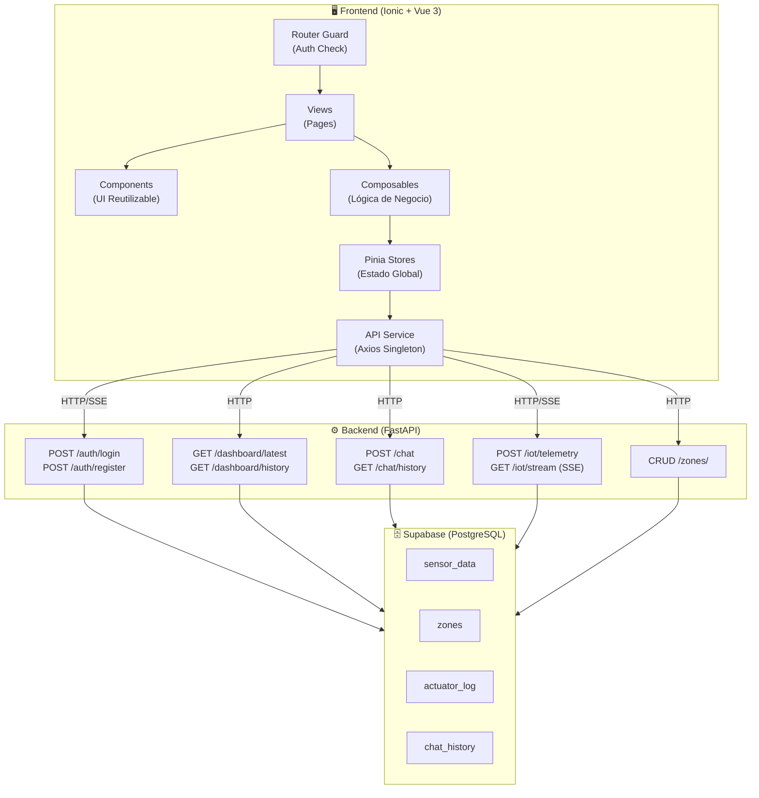
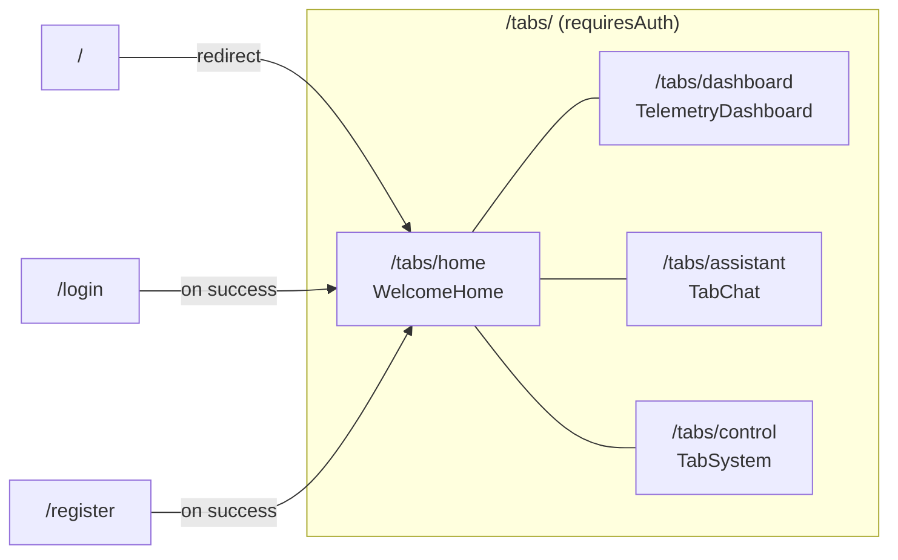
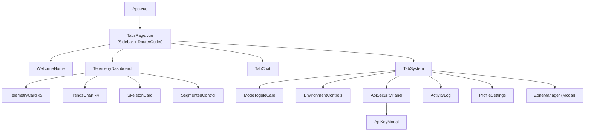
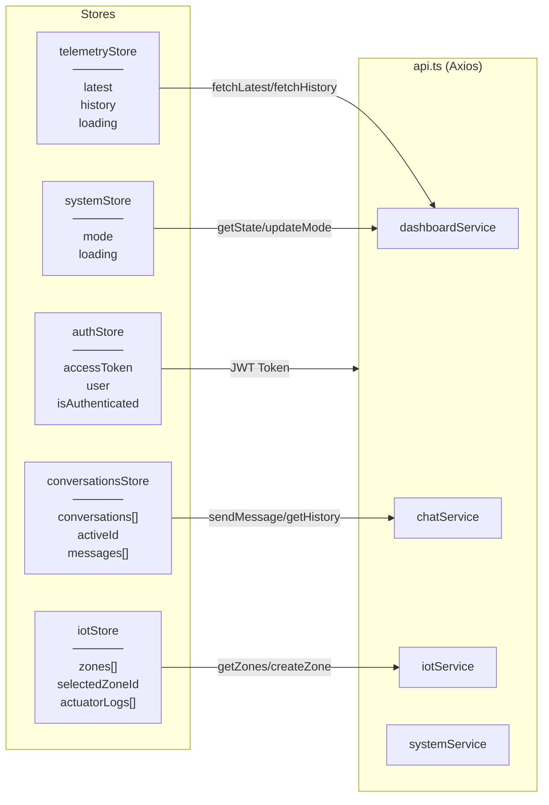
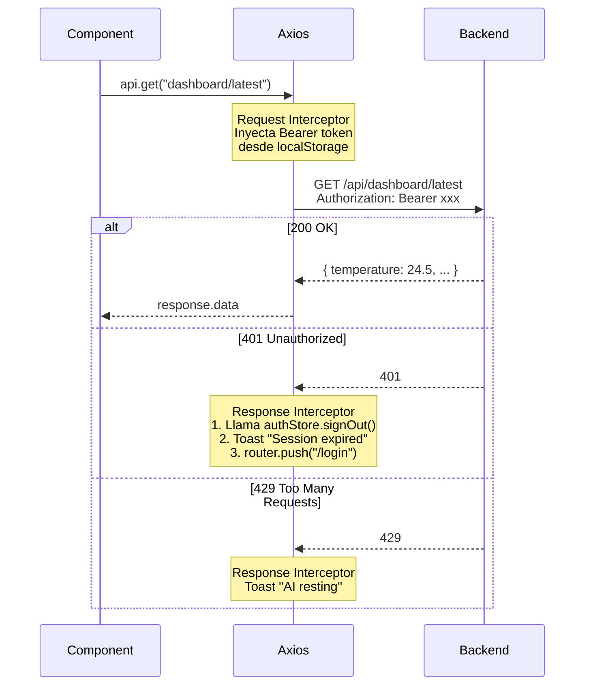
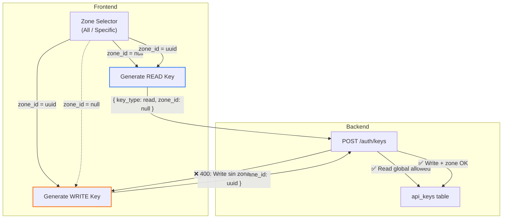
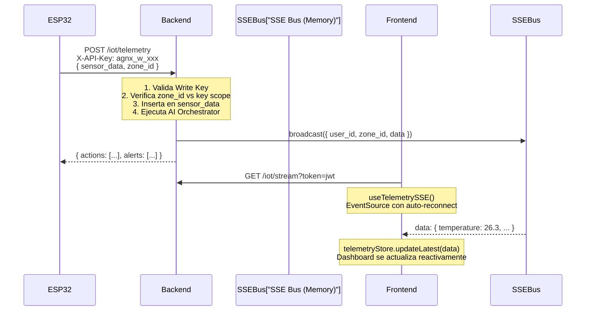

# 🌾 AgroNexus AI — Frontend Technical Documentation

> **Stack**: Ionic 8 + Vue 3 (Composition API) + Pinia + Axios  
> **Backend**: FastAPI DDD-Lite (comunicación exclusiva por API REST + SSE)  
> **Versión**: 2.5.0 — Abril 2026  

---

## 📐 Arquitectura General

El frontend opera como una **SPA (Single Page Application)** desacoplada del backend. Toda la comunicación se realiza a través de un cliente Axios centralizado. No se utiliza el SDK de Supabase en la capa de presentación.



---

## 🗺️ Mapa de Navegación y Rutas



| Ruta | Vista | Descripción | Guard |
|------|-------|-------------|-------|
| `/login` | `LoginPage.vue` | Formulario de autenticación con JWT | Público |
| `/register` | `RegisterPage.vue` | Registro de nuevos usuarios | Público |
| `/tabs/home` | `WelcomeHome.vue` | Landing con métricas de resumen y accesos rápidos | Auth |
| `/tabs/dashboard` | `TelemetryDashboard.vue` | Gráficos en tiempo real con filtro por zona | Auth |
| `/tabs/assistant` | `TabChat.vue` | Asistente IA multi-sesión con markdown | Auth |
| `/tabs/control` | `TabSystem.vue` | Gestión de hardware, zonas y seguridad | Auth |

> **Router Guard**: Un `beforeEach` global verifica `authStore.isAuthenticated`. Si el token expira (401 del backend), el interceptor de Axios limpia el estado y redirige a `/login` automáticamente.

---

## 🧩 Árbol de Componentes



### Componentes Detallados

| Componente | Ubicación | Responsabilidad |
|------------|-----------|-----------------|
| `TelemetryCard` | `components/` | Tarjeta individual de métrica con barra de progreso y unidad |
| `TrendsChart` | `components/` | Gráfico Chart.js con datos históricos y gradiente |
| `SkeletonCard` | `components/` | Placeholder animado durante la carga inicial |
| `SegmentedControl` | `components/` | Selector de rango temporal (1h / 5h / 24h) |
| `ApiKeyModal` | `components/` | Modal que muestra la API Key generada (una sola vez) |
| `ModeToggleCard` | `components/system/` | Switch AUTO / MANUAL con persistencia en DB |
| `EnvironmentControls` | `components/system/` | Controles manuales de actuadores (Bomba, Fan, Luz) |
| `ApiSecurityPanel` | `components/system/` | Provisionamiento de API Keys con validación por zona |
| `ActivityLog` | `components/system/` | Historial paginado de acciones de actuadores |
| `ProfileSettings` | `components/system/` | Edición de nombre y rol del usuario |
| `ZoneManager` | `components/system/` | CRUD modal para gestionar invernaderos/zonas |

---

## 🏪 Flujo de Datos (Stores)



### Detalle de cada Store

#### `authStore` — Autenticación
| Propiedad / Acción | Tipo | Descripción |
|---------------------|------|-------------|
| `accessToken` | `string \| null` | JWT almacenado en `localStorage` |
| `user` | `object \| null` | Metadata del usuario (email, id, rol) |
| `isAuthenticated` | `computed<boolean>` | Derivado de `!!accessToken` |
| `signIn(credentials)` | `async` | Login via `POST /auth/login` |
| `signUp(credentials)` | `async` | Registro via `POST /auth/register` |
| `signOut()` | `sync` | Limpia token + user + localStorage |

#### `telemetryStore` — Datos de Sensores
| Propiedad / Acción | Tipo | Descripción |
|---------------------|------|-------------|
| `latest` | `TelemetryData \| null` | Última lectura (temp, hum, pH, ec, light) |
| `history` | `TelemetryData[]` | Historial ordenado cronológicamente para gráficos |
| `fetchLatest(zoneId?)` | `async` | Obtiene última lectura (filtrada por zona opcionalmente) |
| `fetchHistory(zoneId?)` | `async` | Obtiene historial completo con mapeo de campos |
| `updateLatest(data)` | `sync` | Inyecta datos en tiempo real desde SSE |

#### `iotStore` — Infraestructura y Zonas
| Propiedad / Acción | Tipo | Descripción |
|---------------------|------|-------------|
| `zones` | `Zone[]` | Lista de invernaderos/zonas del usuario |
| `selectedZoneId` | `string \| null` | Zona activa para filtrar telemetría y logs |
| `actuatorLogs` | `ActuatorLogEntry[]` | Historial paginado de acciones |
| `createZone(name, crop)` | `async` | `POST /zones/` — Añade zona y actualiza lista |
| `updateZone(id, name, crop)` | `async` | `PATCH /zones/{id}/` — Edita zona existente |
| `deleteZone(id)` | `async` | `DELETE /zones/{id}/` — Elimina zona |
| `fetchActuatorLogs(reset?)` | `async` | Paginación infinita con `logPage` y `logHasMore` |

#### `conversationsStore` — Chat IA Multi-Sesión
| Propiedad / Acción | Tipo | Descripción |
|---------------------|------|-------------|
| `conversations` | `Conversation[]` | Sesiones de chat ordenadas por `updated_at` |
| `activeConversationId` | `string \| null` | Sesión activa actualmente |
| `messages` | `ChatMessage[]` | Mensajes de la conversación activa |
| `sendMessage(text)` | `async` | Envía mensaje, procesa `actions[]` y `alerts[]` |

---

## 🔌 Capa de Servicios (`api.ts`)

### Configuración del Cliente

```typescript
// La URL base SIEMPRE termina en "/" para evitar errores de concatenación
const rawBaseUrl = import.meta.env.VITE_API_BASE_URL || 'http://localhost:8000/api';
const finalBaseUrl = rawBaseUrl.endsWith('/') ? rawBaseUrl : `${rawBaseUrl}/`;
const api = axios.create({ baseURL: finalBaseUrl });
```

### Interceptores



### Endpoints Disponibles

| Servicio | Método | Endpoint | Zona-Aware |
|----------|--------|----------|:----------:|
| `dashboardService.getLatest` | `GET` | `dashboard/latest` | ✅ |
| `dashboardService.getHistory` | `GET` | `dashboard/history` | ✅ |
| `dashboardService.getState` | `GET` | `dashboard/state` | ❌ |
| `dashboardService.updateMode` | `POST` | `dashboard/mode` | ❌ |
| `chatService.sendMessage` | `POST` | `chat` | ❌ |
| `chatService.getHistory` | `GET` | `chat/history` | ❌ |
| `iotService.getZones` | `GET` | `zones/` | — |
| `iotService.createZone` | `POST` | `zones/` | — |
| `iotService.updateZone` | `PATCH` | `zones/{id}/` | — |
| `iotService.deleteZone` | `DELETE` | `zones/{id}/` | — |
| `iotService.getActuatorLog` | `GET` | `dashboard/actuator-log` | ✅ |
| `systemService.generateApiKey` | `POST` | `auth/keys` | ✅ |

---

## 🔐 Modelo de Seguridad por Zonas



| Tipo de Llave | Scope Permitido | Uso en Hardware |
|:---:|:---:|---|
| `READ` | Global o por Zona | Dashboards de monitoreo, pantallas de lectura |
| `WRITE` | Solo por Zona | ESP32/Arduino con actuadores (bomba, ventilador, luz) |

---

## 🛠️ Diagnóstico y Salud del Sistema

La vista `TabSystem.vue` incluye un módulo de diagnóstico avanzado para operarios y desarrolladores:

- **Health Check**: Verifica la conectividad de todos los nodos de la red IoT y el estado del orquestador AI.
- **Test Telemetry**: Permite inyectar datos sintéticos para validar el comportamiento reactivo de los actuadores y las alertas de la IA sin necesidad de hardware físico.
- **Heartbeat Monitor**: Indicador visual en tiempo real de la sincronización del sistema (Online/Offline).

---

## 🔄 Flujo de Telemetría en Tiempo Real (SSE)



---

## 📂 Estructura de Directorios Detallada

```text
src/
├── components/                     # Componentes UI reutilizables
│   ├── ApiKeyModal.vue             #   Modal de visualización de API Key generada
│   ├── SegmentedControl.vue        #   Selector tipo pill (1h / 5h / 24h)
│   ├── SkeletonCard.vue            #   Placeholder animado de carga
│   ├── TelemetryCard.vue           #   Tarjeta de métrica con progreso visual
│   ├── TrendsChart.vue             #   Gráfico Chart.js con gradiente
│   └── system/                     #   Sub-módulo de control del sistema
│       ├── ActivityLog.vue         #     Historial paginado de actuadores
│       ├── ApiSecurityPanel.vue    #     Panel de generación de API Keys
│       ├── EnvironmentControls.vue #     Controles manuales (Bomba/Fan/Luz)
│       ├── ModeToggleCard.vue      #     Switch AUTO ↔ MANUAL
│       ├── ProfileSettings.vue     #     Edición de perfil de usuario
│       └── ZoneManager.vue         #     CRUD modal de zonas/invernaderos
│
├── composables/                    # Lógica de negocio extraída
│   ├── useActuatorBus.ts           #   Bus reactivo global para acciones de la IA
│   ├── useSystemControls.ts        #   Lógica de modo, actuadores y generación de keys
│   ├── useTelemetry.ts             #   Wrapper reactivo sobre telemetryStore
│   └── useTelemetrySSE.ts          #   Conexión SSE con auto-reconnect (5s)
│
├── router/
│   └── index.ts                    # Definición de rutas + beforeEach guard
│
├── services/
│   └── api.ts                      # Axios singleton + interceptores + todos los servicios
│
├── stores/                         # Estado global (Pinia Composition API)
│   ├── auth.ts                     #   JWT, login, logout, profile
│   ├── conversationsStore.ts       #   Sesiones de chat + mensajes + envío
│   ├── iotStore.ts                 #   Zonas, logs de actuadores, selección
│   ├── system.ts                   #   Modo del sistema (AUTO/MANUAL)
│   └── telemetry.ts                #   Datos de sensores (latest + history)
│
├── theme/
│   └── variables.css               # AG-Design Tokens (colores, radii, spacing)
│
├── types/
│   └── index.ts                    # Interfaces TypeScript del dominio completo
│
└── views/                          # Páginas enrutables (Smart Components)
    ├── LoginPage.vue               #   Formulario de login premium
    ├── RegisterPage.vue            #   Formulario de registro
    ├── TabChat.vue                 #   Asistente IA con multi-sesión y markdown
    ├── TabSystem.vue               #   Panel de control del sistema
    ├── TabsPage.vue                #   Layout principal (Sidebar + RouterOutlet + SSE)
    ├── TelemetryDashboard.vue      #   Dashboard con gráficos y filtro por zona
    └── WelcomeHome.vue             #   Landing con resumen de métricas
```

---

## 🧪 Estrategia de Testing

El frontend cuenta con una suite completa de pruebas automatizadas que garantizan la estabilidad de los flujos críticos. Se han implementado **19 tests** verificados que cubren lógica de negocio, UI y flujos de usuario.

### 1. Niveles de Prueba

| Nivel | Herramienta | Alcance | Ubicación |
|-------|------------|---------|-----------|
| **Unit Testing** | `vitest` | Lógica de Stores (Pinia), servicios y utilidades | `tests/unit/*.spec.ts` |
| **Component Testing**| `vue-test-utils` | Renderizado reactivo, props y eventos de UI | `tests/unit/components/` |
| **E2E Testing** | `cypress` | Flujos completos (Login -> Dashboard -> Gestión) | `tests/e2e/specs/` |

### 2. Cobertura Crítica
- **Auth**: Validación de persistencia de JWT, logout reactivo y protección de rutas.
- **Telemetría**: Mapeo correcto de datos de sensores y balanceo de carga en gráficos.
- **IoT/Zonas**: Ciclo de vida completo de infraestructura y paginación infinita de logs técnicos.

### 3. Entorno y Mocks
- **Mocks Globales**: Ubicados en `tests/unit/setup.ts`. Mockean `axios`, `localStorage` y controladores de Ionic.
- **Aislamiento**: Los tests unitarios no dependen de una API real; utilizan `vi.spyOn` y `vi.mocked` para simular respuestas de red.
- **Configuración Vite**: Soporte para ESM en Ionic Core inyectado vía `server.deps.inline` en `vite.config.ts`.

---

## ⚙️ Variables de Entorno

| Variable | Valor por defecto | Descripción |
|----------|-------------------|-------------|
| `VITE_API_BASE_URL` | `http://localhost:8000/api` | URL base de la API FastAPI. **Debe incluir `/api`** |
| `VITE_SUPABASE_URL` | — | (Legacy) URL del proyecto Supabase |
| `VITE_SUPABASE_ANON_KEY` | — | (Legacy) Clave anónima de Supabase |

---

## 🚀 Comandos

| Comando | Descripción |
|---------|-------------|
| `npm run dev` | Servidor de desarrollo Vite (HMR) |
| `npm run build` | `vue-tsc` + bundle de producción en `/dist` |
| `npm run preview` | Preview del bundle de producción |
| `npm run lint` | Linting con ESLint |
| `npm run test:unit` | Tests unitarios con Vitest |
| `npm run test:e2e` | Tests E2E con Cypress |
| `npx cap sync` | Sincroniza código web con Capacitor (iOS/Android) |

---

## 📦 Dependencias Principales

| Paquete | Versión | Propósito |
|---------|---------|-----------|
| `vue` | ^3.3.0 | Framework reactivo core |
| `@ionic/vue` | ^8.0.0 | Componentes nativos mobile-ready |
| `pinia` | ^3.0.4 | Estado global con Composition API |
| `axios` | ^1.14.0 | Cliente HTTP (único punto de comunicación) |
| `chart.js` + `vue-chartjs` | ^4.5 / ^5.3 | Gráficos de tendencias históricas |
| `marked` + `dompurify` | ^17 / ^3.3 | Renderizado seguro de markdown en el chat |
| `ionicons` | ^7.0.0 | Iconografía del sistema |
| `@capacitor/core` | 8.3.0 | Bridge nativo para iOS/Android |

---

> [!IMPORTANT]
> **Regla de Oro**: Nunca importes `supabase` directamente en componentes o stores. Toda comunicación con el backend debe pasar por `src/services/api.ts`. El SDK de Supabase solo se mantiene como dependencia legacy para compatibilidad con Capacitor Auth.
