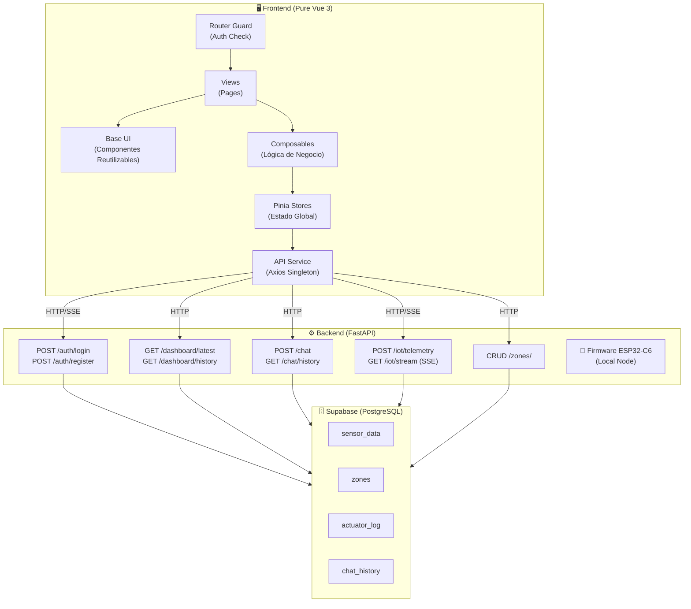
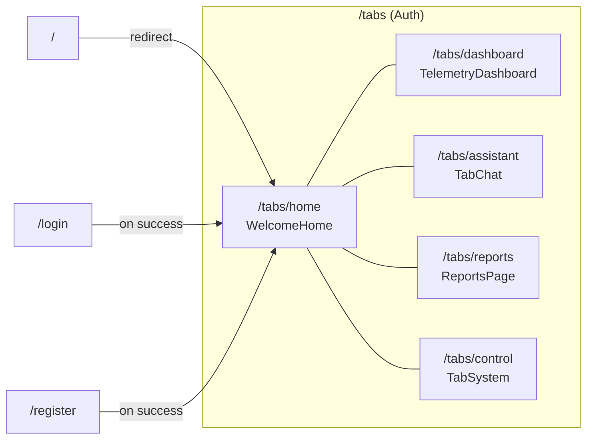
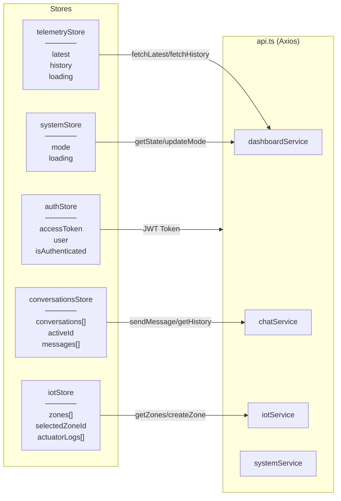
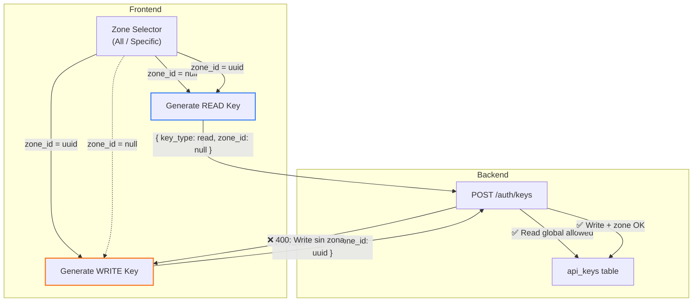
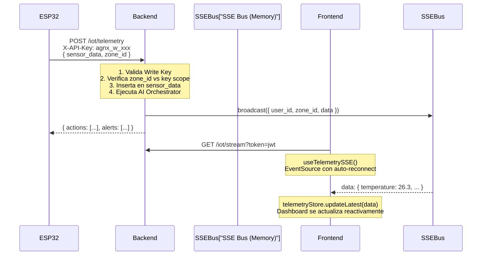

# 🌾 AgroNexus AI — Web Frontend

> **Stack**: Pure Vue 3 (Composition API) + Vite + Pinia + Axios + Lucide Icons  
> **Backend**: FastAPI DDD-Lite (comunicación exclusiva por API REST + SSE)  
> **Versión**: 3.0.0 — Abril 2026  

**AgroNexus AI** es la interfaz web de alto rendimiento para el panel de control de agricultura de precisión. Tras un exhaustivo proceso de refactorización (`Pura Web`), se han eliminado por completo las dependencias de Ionic Framework, Capacitor y dependencias móviles nativas para ofrecer una experiencia ultraligera y rápida basada en **Vanilla Vue 3, HTML Semántico y CSS nativo (Glassmorphism + Modo Oscuro)**.

---

## 📐 Arquitectura General

El frontend opera como una **SPA (Single Page Application)** desacoplada del backend. Toda la comunicación se realiza a través de un cliente Axios centralizado y eventos en tiempo real mediante *Server-Sent Events (SSE)*. No se utiliza el SDK de Supabase en la capa de presentación.



---

## 🗺️ Mapa de Navegación y Rutas



| Ruta | Vista | Descripción | Guard |
|------|-------|-------------|-------|
| `/login` | `LoginPage.vue` | Formulario de autenticación con JWT | Público |
| `/register` | `RegisterPage.vue` | Registro de nuevos usuarios | Público |
| `/tabs/home` | `WelcomeHome.vue` | Landing con métricas de resumen y accesos rápidos | Auth |
| `/tabs/dashboard` | `TelemetryDashboard.vue` | Gráficos en tiempo real con filtro por zona | Auth |
| `/tabs/assistant` | `TabChat.vue` | Asistente IA multi-sesión con markdown | Auth |
| `/tabs/reports` | `ReportsPage.vue` | Generador de informes IA con selección de zona, enfoque y rango | Auth |
| `/tabs/control` | `TabSystem.vue` | Gestión de hardware, zonas y seguridad | Auth |

> **Router Guard**: Un `beforeEach` global verifica `authStore.isAuthenticated`. Si el token expira (401 del backend), el interceptor de Axios limpia el estado y redirige a `/login` automáticamente.

---

## 🏬 Gestión de Estado Centralizado (Pinia)

El estado crítico de la aplicación se fragmenta lógicamente en Stores de Pinia que actúan como Single Source of Truth.



---

## 🔌 Capa de Servicios (`api.ts`)

La configuración del cliente principal aísla toda lógica externa desde un solo origen.

### Endpoints Disponibles (REST)

| Servicio | Método | Endpoint | Zona-Aware |
|----------|--------|----------|:----------:|
| `dashboardService.getLatest` | `GET` | `dashboard/latest` | ✅ |
| `dashboardService.getHistory` | `GET` | `dashboard/history` | ✅ |
| `dashboardService.getState` | `GET` | `dashboard/state` | ❌ |
| `dashboardService.updateMode` | `POST` | `dashboard/mode` | ❌ |
| `chatService.sendMessage` | `POST` | `chat` | ❌ |
| `chatService.getHistory` | `GET` | `chat/history` | ❌ |
| `chatService.generateReport` | `POST` | `chat/report` | ✅ |
| `iotService.getZones` | `GET` | `zones/` | — |
| `iotService.createZone` | `POST` | `zones/` | — |
| `iotService.updateZone` | `PATCH` | `zones/{id}/` | — |
| `iotService.deleteZone` | `DELETE` | `zones/{id}/` | — |
| `iotService.getActuatorLog` | `GET` | `dashboard/actuator-log` | ✅ |
| `systemService.generateApiKey` | `POST` | `auth/keys` | ✅ |

---

## 🔐 Modelo de Seguridad por Zonas



| Tipo de Llave | Scope Permitido | Uso en Hardware |
|:---:|:---:|---|
| `READ` | Global o por Zona | Dashboards de monitoreo, pantallas de lectura |
| `WRITE` | Solo por Zona | ESP32/Arduino con actuadores (bomba, ventilador, luz) |

---

## 🔄 Flujo de Telemetría en Tiempo Real (SSE)



---

## 🛡️ Resiliencia y Degradación Elegante

### Manejo de HTTP 429 (Too Many Requests)

Cuando el backend agota la cuota de la API de IA (Gemini), responde con `429`. El frontend maneja este escenario **en cada punto de consumo** para ofrecer mensajes contextuales sin bloquear al usuario, por medio de notificaciones nativas (`AppToast.vue` inyectado mediante Teleport).

### Modo Fallback del Reporte

Si la IA falla por cuota o latencia tras reintentos, el backend responde con `200 OK` y un cuerpo Markdown de emergencia analítico (fallback modal). El componente web **`MarkdownRenderer.vue`** domina la sintaxis `GitHub Alerts` (`> [!WARNING]`, `> [!NOTE]`) traduciéndolo visualmente a la UI del reporte degenerado.

---

## 📂 Árbol de Directorios 

```text
src/
├── components/                     # Micro-UI y componentes modulares
│   ├── AppModal.vue                #   Ventanas flotantes teletransportadas
│   ├── AppSelect.vue               #   Drop-downs opacos y blindados ante z-index
│   ├── AppToast.vue                #   Snackbars / Toasts reactivos
│   ├── MarkdownRenderer.vue        #   Render seguro de GFM y GitHub Alerts
│   └── system/                     #   Gestión del entorno IoT 
│       ├── ApiSecurityPanel.vue    
│       ├── ZoneManager.vue         
│       └── ...                     
│
├── composables/                    # Lógica Vue separada de los templates
│   ├── useToast.ts                 #   Inyección funcional de Toasts
│   ├── useModal.ts                 #   Orquestación de `<AppModal>`
│   └── useTelemetrySSE.ts          #   Worker nativo con Server Sent Events
│
├── services/                       # Conectividad remota
│   └── api.ts                      #   Instancia maestra de Axios
│
├── stores/                         # Pinia state managers
│   ├── auth.ts                     
│   ├── iotStore.ts                 
│   └── ...                         
│
├── theme/
│   └── variables.css               # Diseño de sistema Premium Dark-Emerald
│
└── views/                          # Páginas maestras con Vue Router
    ├── TabChat.vue                 #   Orquestación del chat RAG
    ├── ReportsPage.vue             
    └── ...                         
```

---

## 🧪 Estrategia de Testing

El frontend mantiene pruebas asiladas utilizando el estándar de **Vitest** comprobando que la UI actúe conforme a los contratos pre-definidos:

*   **Unit Testing**: Implementado con `@vue/test-utils` para garantizar simulaciones reactivas del comportamiento (Ej. `TelemetryCard.spec.ts`).
*   **Mocks**: Aislamiento independiente. Las consultas en tests no corren directamente con Axios sino a través de objetos ES Simulados.

```bash
npm run test:unit
```

### Entorno y Ejecución

Rellena tu archivo `.env.local` con las variables críticas listadas en su respectivo `.env.example`:

| Variable | Descripción |
|----------|-------------|
| `VITE_API_BASE_URL` | URL base de la API FastAPI. **Debe incluir `/api`** |

Para ejecutar localmente el cliente nativo:

```bash
# Servidor de UI ultrarrápido
npm run dev

# Bundle para hosting
npm run build
```
